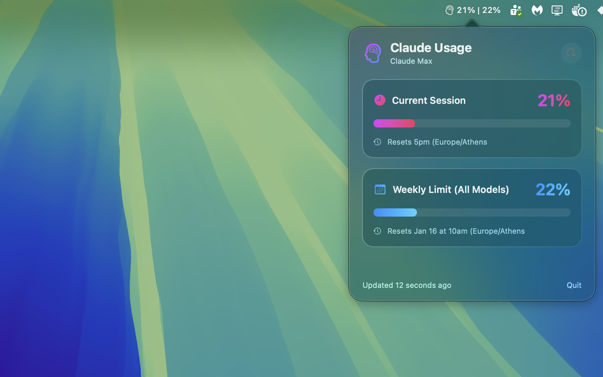

# Claude Usage Bar

[](https://www.apple.com/macos/)
[](https://swift.org/)
[](https://www.python.org/)
[](LICENSE)
[](https://claude.ai/code)

A beautiful macOS menu bar app that displays your **Claude Code** usage statistics in real-time. Monitor your session and weekly limits at a glance with a stunning glassmorphic UI.

<p align="center">
  
</p>

## Features

- **Real-time Usage Tracking** - See your current session and weekly usage percentages directly in the menu bar
- **Glassmorphic UI** - Beautiful, modern popup with gradient progress bars
- **Auto-refresh** - Automatically updates every 60 seconds
- **Multiple Model Support** - Tracks usage for all models and Sonnet-specific limits
- **Reset Time Display** - Know exactly when your limits reset
- **Native macOS App** - Built with SwiftUI for optimal performance

## Requirements

- **macOS 13.0** (Ventura) or later
- **Claude Code CLI** - [Install from claude.ai/code](https://claude.ai/code)
- **Python 3.6+** (comes pre-installed on macOS)
- **Claude Pro/Max subscription** (for usage limits to track)

## Installation

### Option 1: Download Release (Recommended)

1. Download the latest `.app` from [Releases](../../releases)
2. Move `ClaudeUsageBar.app` to your Applications folder
3. Open the app (you may need to right-click → Open the first time)

### Option 2: Build from Source

1. Clone this repository:
   ```bash
   git clone https://github.com/YOUR_USERNAME/claude-usage-bar.git
   cd claude-usage-bar
   ```

2. Open in Xcode:
   ```bash
   open ClaudeUsageBar.xcodeproj
   ```

3. Build and run (⌘+R)

Or build from command line:
```bash
xcodebuild -project ClaudeUsageBar.xcodeproj -scheme ClaudeUsageBar -configuration Release build
```

## Usage

1. **Launch the app** - A brain icon appears in your menu bar
2. **View quick stats** - The menu bar shows `🧠 X% | Y%` (session | weekly)
3. **Click for details** - Opens a popup with full usage information:
   - Current session usage with reset time
   - Weekly limit (all models) with reset date
   - Sonnet-specific usage (if applicable)

### Menu Bar Display

```
🧠 19% | 22%
   ↑      ↑
   │      └── Weekly usage (all models)
   └── Current session usage
```

## How It Works

The app uses a Python script to interact with the Claude Code CLI:

1. Spawns Claude CLI in an interactive pseudo-terminal
2. Sends the `/usage` command
3. Parses the terminal output to extract usage data
4. Displays the results in a native SwiftUI interface

This approach ensures compatibility with Claude's interactive features while providing a seamless native experience.

## Project Structure

```
claude-usage-bar/
├── ClaudeUsageBar/
│   ├── ClaudeUsageBarApp.swift    # App entry point & menu bar setup
│   ├── UsageManager.swift          # Usage data fetching & parsing
│   ├── UsagePopoverView.swift      # SwiftUI popup interface
│   └── Info.plist                  # App configuration
├── get_claude_usage.py             # Python script for CLI interaction
├── ClaudeUsageBar.xcodeproj/       # Xcode project
└── README.md
```

## Configuration

The app uses sensible defaults, but you can modify these in the source:

| Setting | Location | Default | Description |
|---------|----------|---------|-------------|
| Refresh Interval | `ClaudeUsageBarApp.swift` | 60 seconds | How often to fetch new data |
| Popover Size | `ClaudeUsageBarApp.swift` | 360×400 | Size of the detail popup |

## Troubleshooting

### "Claude CLI not found"
- Ensure Claude Code is installed: `which claude`
- If using nvm, the app searches common paths automatically

### "Python 3 not found"
- macOS should have Python 3 pre-installed
- Check with: `python3 --version`

### Usage not updating
- Click the refresh button in the popup
- Ensure you have an active Claude Pro/Max subscription
- Check that `claude` works in your terminal

### App won't open (macOS security)
- Right-click the app → Open → Open
- Or: System Settings → Privacy & Security → Open Anyway

## Contributing

Contributions are welcome! Please feel free to submit a Pull Request.

1. Fork the repository
2. Create your feature branch (`git checkout -b feature/amazing-feature`)
3. Commit your changes (`git commit -m 'Add amazing feature'`)
4. Push to the branch (`git push origin feature/amazing-feature`)
5. Open a Pull Request

## License

This project is licensed under the MIT License - see the [LICENSE](LICENSE) file for details.

## Acknowledgments

- Built entirely with [Claude Code](https://claude.ai/code)
- Inspired by the need to track Claude usage without constantly running `/usage`
- Thanks to the Claude team for the amazing CLI tool

---

<p align="center">
  Made with ❤️ and Claude Code
</p>
